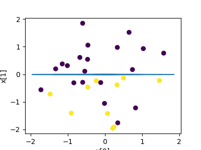
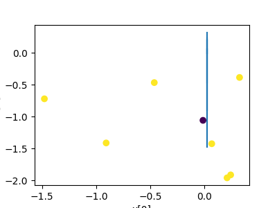
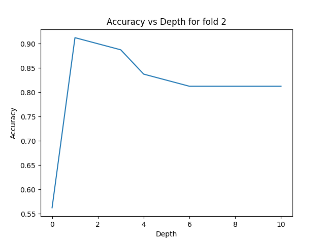
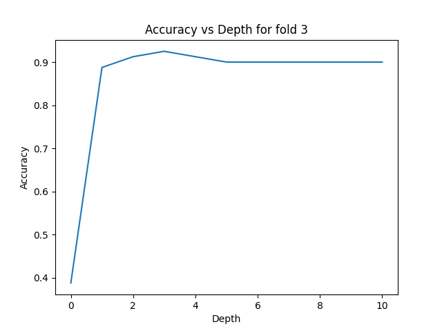
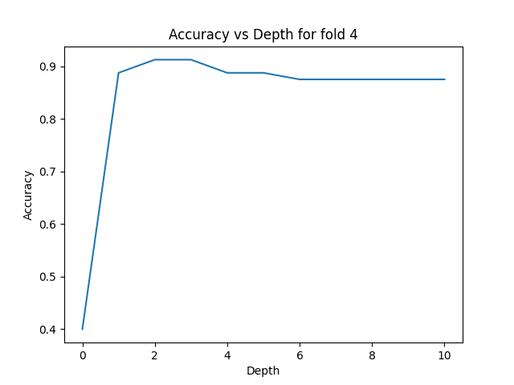
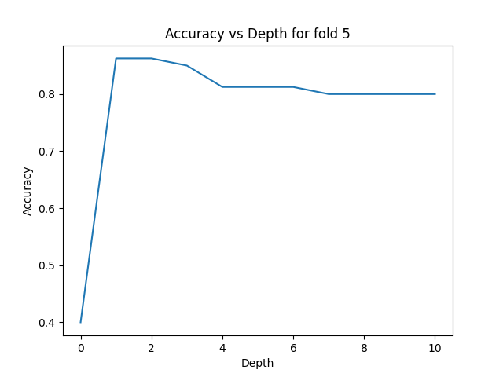

# PART A: 

Show the usage of *your decision tree* on the above dataset. The first 70% of the data should be used for training purposes and the remaining 30% for test purposes. Show the accuracy, per-class precision and recall of the decision tree you implemented on the test dataset.

> (70, 2) (30, 2) (70,) (30,)

```python
 Y: ?(X0 > 0.043777523046321265
         Y: Class 1
 N: ?(X0 <= 0.043777523046321265
         Y: ?(X0 > -0.17186200022530262
                 Y: ?(X0 > -0.009944371488954856
                         Y: Class 0
                 N: ?(X0 <= -0.009944371488954856
                         Y: ?(X0 > -0.02217129486290728
                                 Y: Class 1
                         N: ?(X0 <= -0.02217129486290728
                                 Y: ?(X0 > -0.15154643493571088
                                         Y: Class 0
                                 N: ?(X0 <= -0.15154643493571088
                                         Y: Class 1
         N: ?(X0 <= -0.17186200022530262
                 Y: ?(X1 > 1.3334978201484127
                         Y: Class 1
                 N: ?(X1 <= 1.3334978201484127
                         Y: ?(X1 > -1.0534230074515962
                                 Y: ?(X1 > -0.2335452640026076
                                         Y: ?(X1 > -0.22484794684042053
                                                 Y: ?(X0 > -0.5803487742844701
                                                         Y: ?(X0 > -0.5451447395508547
                                                                 Y: Class 0
                                                         N: ?(X0 <= -0.5451447395508547
                                                                 Y: Class 1
                                                 N: ?(X0 <= -0.5803487742844701
                                                         Y: Class 0
                                         N: ?(X1 <= -0.22484794684042053
                                                 Y: Class 1
                                 N: ?(X1 <= -0.2335452640026076
                                         Y: Class 0
                         N: ?(X1 <= -1.0534230074515962
                                 Y: ?(X0 > -0.23210583396758255
                                         Y: Class 0
                                 N: ?(X0 <= -0.23210583396758255
                                         Y: Class 1
```





> Training Results:
- Criteria : information_gain
- Accuracy:  1.0
- Class:  1
    - Precision:  1.0 
    - Recall:  1.0

- Class:  0
    - Precision:  1.0
    - Recall:  1.0

> Testing Results:
 - Criteria : information_gain
 - Accuracy:  0.9
 - Class:  0
    - Precision:  0.9090909090909091
    - Recall:  0.8333333333333334

- Class:  1
    - Precision:  0.8947368421052632
    - Recall:  0.9444444444444444

## OUTERFOLD 1

```{0: 0.375, 1: 0.8875, 2: 0.9125000000000001, 3: 0.8999999999999999, 4: 0.8875, 5: 0.8875, 6: 0.8875, 7: 0.8875, 8: 0.8875, 9: 0.8875, 10: 0.8875}```

> Max_depth: 2  
> Testing Score: 0.9


## OUTERFOLD 2


```{0: 0.5625, 1: 0.9125, 2: 0.9, 3: 0.8875, 4: 0.8374999999999999, 5: 0.825, 6: 0.8125, 7: 0.8125, 8: 0.8125, 9: 0.8125, 10: 0.8125}```

> Max_depth: 1  
> Testing Score: 0.85



## OUTERFOLD 3

```{0: 0.3875, 1: 0.8875, 2: 0.9124999999999999, 3: 0.925, 4: 0.9124999999999999, 5: 0.8999999999999999, 6: 0.8999999999999999, 7: 0.8999999999999999, 8: 0.8999999999999999, 9: 0.8999999999999999, 10: 0.8999999999999999}```

> Max_depth: 3  
> Testing Score: 0.9




## OUTERFOLD 4

```{0: 0.39999999999999997, 1: 0.8875000000000001, 2: 0.9125, 3: 0.9125, 4: 0.8875, 5: 0.8875, 6: 0.875, 7: 0.875, 8: 0.875, 9: 0.875, 10: 0.875}```

> Max_depth: 2  
> Testing Score: 0.85




## OUTERFOLD 5

```{0: 0.4, 1: 0.8625, 2: 0.8625, 3: 0.8500000000000001, 4: 0.8125, 5: 0.8125, 6: 0.8125, 7: 0.8, 8: 0.8, 9: 0.8, 10: 0.8}```
> Max_depth: 1  
Testing Score: 0.95




## FINAL SCORE FOR EACH FOLD
`TRAINING SCORE:`  
FOLD NO| DEPTH | ACCURACY |
---|---|---
 1|2| 0.9  
 2|1| 0.85  
 3|3| 0.9  
 4|2| 0.85  
 5|1| 0.95


