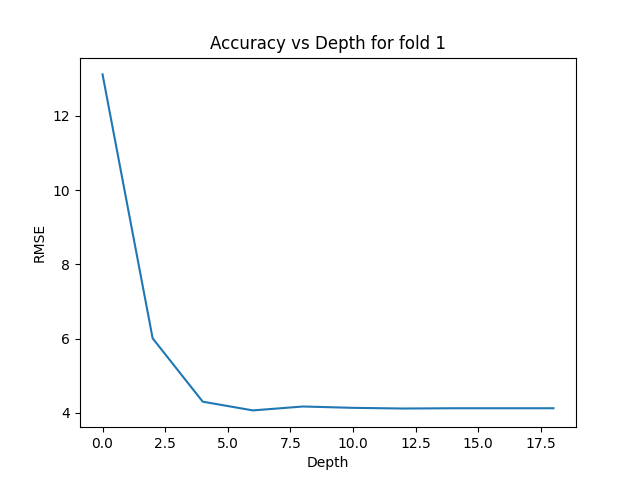
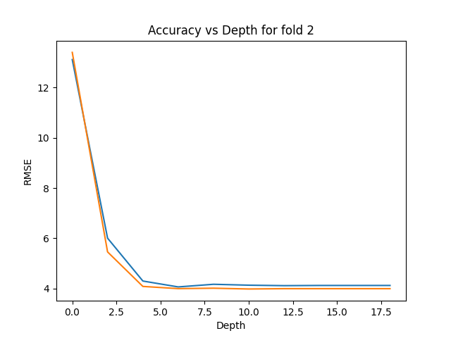
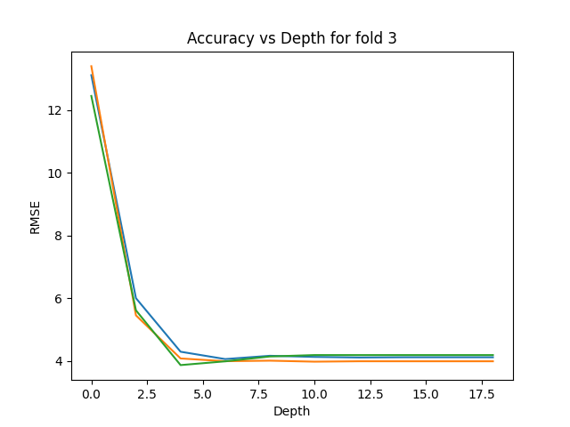
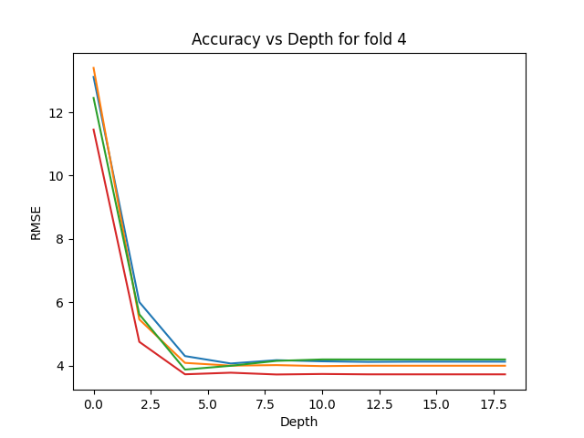
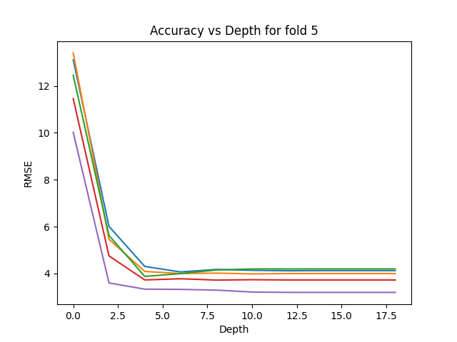

> First applied the cross-validation on the current dataset to find the optimal depth 

`Comparision parameter: RMSE value`

# RESULTS of NCV

# FOLD 1

```{0: 13.115380587291643, 2: 6.006763503067283, 4: 4.300392967605698, 6: 4.065903830706041, 8: 4.1708971265862, 10: 4.134908058167339, 12: 4.116406684674127, 14: 4.123947476301359, 16: 4.123947476301359, 18: 4.123947476301359```  

> Max_depth: 6  
> Testing RMSE: 2.557041559783794




```{0: 13.401287915618992, 2: 5.459218152338462, 4: 4.085611835371805, 6: 3.998106438013325, 8: 4.0151979042983434, 10: 3.983571556255007, 12: 3.9963773974858965, 14: 3.9958969801811293, 16: 3.9958969801811293, 18: 3.9958969801811293}```

> Max_depth: 10  
> Testing RMSE: 2.7735009811261455




```{0: 12.452866871725941, 2: 5.619515310765378, 4: 3.8743594255270297, 6: 3.994049479494136, 8: 4.1485350767343165, 10: 4.194085497687073, 12: 4.193495310875556, 14: 4.193877092068196, 16: 4.193877092068196, 18: 4.193877092068196}```
> Max_depth: 4  
> Testing RMSE:  4.675914585959615




```{0: 11.453362483291857, 2: 4.750237935330066, 4: 3.7250680586484997, 6: 3.7755088893290987, 8: 3.7188463279601986, 10: 3.734822939370142, 12: 3.723385091883559, 14: 3.723385091883559, 16: 3.723385091883559, 18: 3.723385091883559}```
> Max_depth: 8  
> Testing RMSE:  4.710163587991507)




```{0: 10.01839516781437, 2: 3.5971002883383028, 4: 3.3313366919493737, 6: 3.3224218694170924, 8: 3.2899616162998155, 10: 3.20889928908179, 12: 3.1943738043307524, 14: 3.1929880538188256, 16: 3.1929880538188256, 18: 3.1929880538188256}```
> Max_depth: 14  
> Testing RMSE: 5.029621119686346)




## RESULTS FOR OUR DECISION TREE IMPLEMENTATION

- Train RMSE:  0.0982270955506651
- Test RMSE:  5.029621119686346
- Train MAE:  0.01022364217252397
- Test MAE:  3.9101265822784814

## RESULTS FOR SKLEARN DECISION TREE IMPLEMENTATION
 - Train RMSE:  0.0
 - Test RMSE:  4.979248075001391
 - Train MAE:  0.0
 - Test MAE:  3.8202531645569615