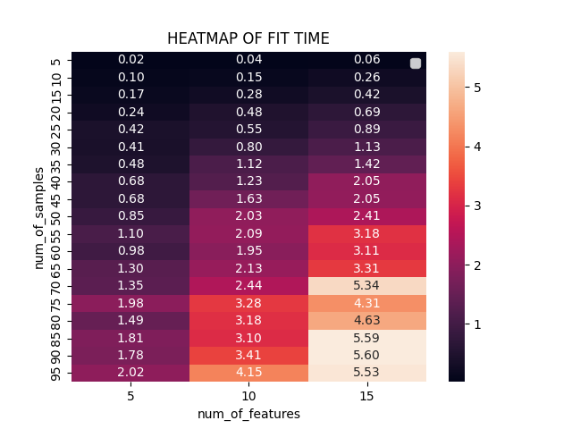
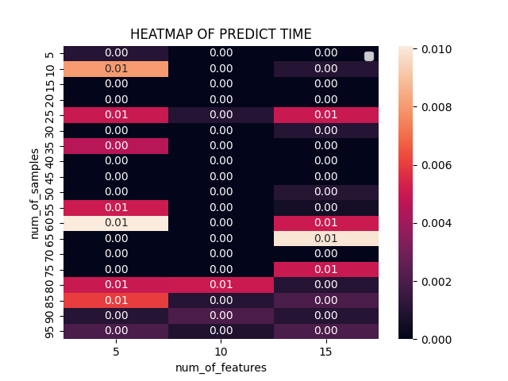

# for real input and  real output

- MSE- fit 5.69285435410633  
- MSE- predict 8.917084747943654e-07

# for discrete input and  discrete output

- MSE- fit 0.05830230833728385  
- MSE- predict 5.909952630501817e-05

# for discrete input and  real output

- MSE- fit 2.2300657757448823  
- MSE- predict 1.3064419493858032e-05

# for real input and  discrete output

- MSE- fit 2.2768845646967892  
- MSE- predict 9.846790865259736e-07

# . 
time complexity of a decision tree depends on the depth and breadth of the tree. 
So the net time complexity of predicting the label will be.  

DISCRETE input
(number of classes in each categorical data) * (number of categorical features or max depth)

Real input 
( max_depth) 

