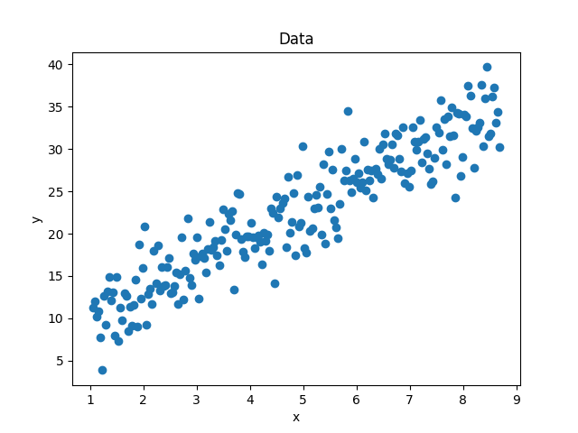

# Question 1

## For linear regression using sklearn : 
## OUTPUT
```python
(300, 5)
X:  (300, 5) y:  (300,)
COEFFIECIENT SKLEARN:  [ 0.03052301  0.10025002  0.03253045 -0.02029392 -0.04827887 -0.00229394]


RMSE:  1.0238779476452047
MAE:  0.8009311093282274
Time taken:  0.004429459571838379
```
---------------------------
## For linear regression using normal equations : 
$$ Coefficients =(X^⊤ X)^-1  (X^⊤ y) $$
$$ yhat = X * Coeffients$$
https://dafriedman97.github.io/mlbook/content/c1/s1/likelihood_maximization.html#multiple-regression

## Output
```python
X:  (300, 6) y:  (300,)
Coefficient : [ 0.03052301  0.10025002  0.03253045 -0.02029392 -0.04827887 -0.00229394]


RMSE:  1.0238779476452047
MAE:  0.8009311093282275
Time taken:  0.0017742395401000976
```
---------------------------
## For linear regression using SVD : 


$$ U,S,V = SVD(X)$$
$$Coefficients = V^T * S^-1 * U^T * y $$
$$ yhat = X * Coeffients$$
https://sthalles.github.io/svd-for-regression/

## Output
```python
X:  (300, 6) y:  (300,)
Coefficients:  [ 0.03052301  0.10025002  0.03253045 -0.02029392 -0.04827887 -0.00229394]


RMSE:  1.0238779476452047
MAE:  0.8009311093282275
Time taken:  0.0027515649795532226
---------------------------
```

## PLOTS

<!--  -->
> No Plots


# Question 2

## OUTPUT

### Linear regression using Sklearn library
```python
(90, 10) (90,)
SKLEARNS Linear Regression : 
X:  (90, 10) y:  (90,)
COEFFIECIENT SKLEARN:  [-0.04915876 -0.07930677 -0.16914422  0.08135616 -0.29834532 -0.21123827
 -0.04611229  0.20431096 -0.09189773  0.07006745  0.1385342 ]
Time taken:  0.005137920379638672
 Batch size= 90 , RMSE:  0.8430460917514496
 Batch size= 90 , MAE:  0.6830614115508149
```
---------------------------
### Manual Batch Gradient Descent 
```python
Batch Gradient Descent with manual gradient computation for unregularized objective : 
X:  (90, 11) y:  (90,)
Coeffiecient Gradient Descent  [ 0.00203439 -0.01342561 -0.02524158  0.01099328 -0.05223896 -0.03364641
 -0.01447116  0.03432683 -0.01014776  0.01030757  0.00788452]
Time taken:  0.03889203071594238
 Batch size= 90 , RMSE:  0.9275711539825902
 Batch size= 90 , MAE:  0.7476942558204573
---------------------------
Batch Gradient Descent with manual gradient computation for ridge regression : 
X:  (90, 11) y:  (90,)
Coeffiecient Gradient Descent  [ 0.00203284 -0.01341275 -0.02521727  0.01098259 -0.05218899 -0.03361417
 -0.01445762  0.03429394 -0.01013789  0.0102977   0.00787638]
Time taken:  0.039129018783569336
 Batch size= 90 , RMSE:  0.9276013363438769
 Batch size= 90 , MAE:  0.7477160654328989
```
---------------------------
### JAX Batch Gradient Descent 
```python
Batch Gradient Descent with JAX gradient computation for unregularized objective : 
No GPU/TPU found, falling back to CPU. (Set TF_CPP_MIN_LOG_LEVEL=0 and rerun for more info.)
X:  (90, 11) y:  (90,)
Coeffiecient Gradient Descent  [ 0.00203439 -0.01342561 -0.02524158  0.01099328 -0.05223897 -0.03364641
 -0.01447115  0.03432684 -0.01014776  0.01030757  0.00788452]
Time taken:  1.06673002243042
 Batch size= 90 , RMSE:  0.9275711519261427
 Batch size= 90 , MAE:  0.7476942549867803
---------------------------
Batch Gradient Descent with JAX gradient computation for lasso regression : 
X:  (90, 11) y:  (90,)
Coeffiecient Gradient Descent  [ 0.00116202 -0.01250474 -0.02435296  0.01009512 -0.05134346 -0.03276357
 -0.01362183  0.03338888 -0.00922724  0.00938523  0.00692491]
Time taken:  0.8067018985748291
 Batch size= 90 , RMSE:  0.9285229536073145
 Batch size= 90 , MAE:  0.748338309246766
---------------------------
Batch Gradient Descent with JAX gradient computation for ridge regression : 
X:  (90, 11) y:  (90,)
Coeffiecient Gradient Descent  [ 0.00203284 -0.01341275 -0.02521727  0.01098259 -0.052189   -0.03361417
 -0.01445762  0.03429395 -0.01013789  0.0102977   0.00787638]
Time taken:  0.7485437393188477
 Batch size= 90 , RMSE:  0.927601332407688
 Batch size= 90 , MAE:  0.7477160632339286
 ```
---------------------------
### SGD with ridge regularization:

```python
Stochastic Gradient Descent with manual gradient computation for ridge regression : 
X:  (90, 11) y:  (90,)
Coeffiecient Gradient Descent  [-0.04573638 -0.07962347 -0.17047299  0.07298063 -0.30070803 -0.20615091
 -0.0527305   0.20686456 -0.08998303  0.06320793  0.13576819]
Time taken:  2.1087734699249268
 Batch size= 1 , RMSE:  0.8431872450050696
 Batch size= 1 , MAE:  0.6844984977668036
---------------------------
Stochastic Gradient Descent with JAX gradient computation for ridge regression : 
X:  (90, 11) y:  (90,)
Coeffiecient Gradient Descent  [ 0.00203284 -0.01341275 -0.02521727  0.01098259 -0.052189   -0.03361417
 -0.01445762  0.03429395 -0.01013789  0.0102977   0.00787638]
Time taken:  0.7122681140899658
 Batch size= 90 , RMSE:  0.927601332407688
 Batch size= 90 , MAE:  0.7477160632339286
 ```
---------------------------
### Mini Batch Gradient Descent 
```python
mini-batch SGD with manual gradient computation for ridge regression : 
X:  (90, 11) y:  (90,)
Coeffiecient Gradient Descent  [-0.01269902 -0.06125306 -0.11279393  0.02498508 -0.20584664 -0.11482418
 -0.05305984  0.15091195 -0.05788358  0.01235405  0.05798895]
Time taken:  0.1922290325164795
 Batch size= 16 , RMSE:  0.8610040456223153
 Batch size= 16 , MAE:  0.7011801027217618
 ```
---------------------------
### SGD with Momemtum

```python
SGD_with_momentum with manual gradient computation for ridge regression : 
X:  (90, 11) y:  (90,)
Coefficients: SGD with momentum  [-0.03560873 -0.07527269 -0.19966022  0.07277175 -0.30690035 -0.2322405
 -0.09316126  0.21067944 -0.03578087  0.06551612  0.17782117]
Time taken:  2.0660765171051025
RMSE:  0.8494070875527637
MAE:  0.6822267435920664
---------------------------
SGD_with_momentum  with JAX gradient computation for ridge regression : 
X:  (90, 11) y:  (90,)
Coefficients: SGD with momentum  [-0.03560873 -0.07527269 -0.19966022  0.07277175 -0.30690035 -0.2322405
 -0.09316126  0.21067944 -0.03578087  0.06551612  0.17782117]
Time taken:  2.0643692016601562
RMSE:  0.8494070875527637
MAE:  0.6822267435920664
```
---------------------------
### Q3: Hyper-parameter tuning Learning rate, Penalty_value, Beta(Momemtum rate) for SGD with Momemtum to find least RMSE
```python
X:  (90, 11) y:  (90,)

       lr  penalty_value  beta          rmse      time
0   0.001          0.001  0.01  8.431932e-01  0.870639
1   0.001          0.001  0.05  8.432038e-01  0.868714
2   0.001          0.001  0.10  8.432192e-01  0.853772
3   0.001          0.001  0.50  8.434747e-01  0.862918
4   0.001          0.001  0.90  8.495059e-01  0.879397
5   0.001          0.010  0.01  8.431996e-01  0.872308
6   0.001          0.010  0.05  8.432071e-01  0.889870
7   0.001          0.010  0.10  8.432189e-01  0.882131
8   0.001          0.010  0.50  8.434496e-01  0.862105
9   0.001          0.010  0.90  8.494071e-01  0.889340
10  0.001          0.100  0.01  8.444644e-01  0.893398
11  0.001          0.100  0.05  8.444518e-01  0.878012
12  0.001          0.100  0.10  8.444391e-01  0.878320
13  0.001          0.100  0.50  8.444530e-01  0.900935
14  0.001          0.100  0.90  8.495439e-01  0.902635
15  0.001          0.500  0.01  8.593968e-01  0.912535
16  0.001          0.500  0.05  8.593469e-01  0.891643
17  0.001          0.500  0.10  8.592824e-01  0.896148
18  0.001          0.500  0.50  8.585889e-01  0.909937
19  0.001          0.500  0.90  8.594798e-01  0.885203
20  0.010          0.001  0.01  8.659260e-01  0.941232
21  0.010          0.001  0.05  8.680554e-01  0.900301
22  0.010          0.001  0.10  8.711171e-01  0.895663
23  0.010          0.001  0.50  9.306984e-01  0.876238
24  0.010          0.001  0.90  6.489651e+05  0.895450
25  0.010          0.010  0.01  8.657498e-01  0.884993
26  0.010          0.010  0.05  8.678709e-01  0.916013
27  0.010          0.010  0.10  8.709218e-01  0.882411
28  0.010          0.010  0.50  9.302619e-01  0.892353
29  0.010          0.010  0.90  5.663437e+04  0.899547
30  0.010          0.100  0.01  8.650743e-01  0.875868
31  0.010          0.100  0.05  8.671052e-01  0.884965
32  0.010          0.100  0.10  8.700361e-01  0.879526
33  0.010          0.100  0.50  9.267497e-01  0.941590
34  0.010          0.100  0.90  2.514741e+00  0.892132
35  0.010          0.500  0.01  8.722039e-01  0.900676
36  0.010          0.500  0.05  8.738591e-01  0.896113
37  0.010          0.500  0.10  8.762818e-01  0.890846
38  0.010          0.500  0.50  9.229066e-01  0.891598
39  0.010          0.500  0.90  1.301877e+00  0.885177
40  0.100          0.001  0.01  6.990740e+50  0.963681
41  0.100          0.001  0.05  2.849415e+61  0.880597
42  0.100          0.001  0.10  3.577392e+73  0.905939
43  0.100          0.001  0.50           inf  0.940382
44  0.100          0.001  0.90           NaN  1.106677
45  0.100          0.010  0.01  5.343400e+48  0.944490
46  0.100          0.010  0.05  8.520066e+58  0.787046
47  0.100          0.010  0.10  1.582719e+71  0.799896
48  0.100          0.010  0.50           inf  0.806202
49  0.100          0.010  0.90           NaN  0.862651
50  0.100          0.100  0.01  2.373791e+26  0.812973
51  0.100          0.100  0.05  1.096053e+36  0.804286
52  0.100          0.100  0.10  6.191876e+46  0.789459
53  0.100          0.100  0.50           inf  0.792991
54  0.100          0.100  0.90           NaN  0.861562
55  0.100          0.500  0.01  2.314279e+00  0.858139
56  0.100          0.500  0.05  2.476954e+00  1.399372
57  0.100          0.500  0.10  2.726415e+00  1.455684
58  0.100          0.500  0.50  1.421040e+99  1.077470
59  0.100          0.500  0.90           NaN  1.417066


```

### Optimum values of hyper-parameters:


|lr|penalty_value|beta|rmse|time|
|--|------------ |----|----|----|
|0.001|0.001  |0.01 |0.843193 |0.870639|

> Best RMSE:  0.843193153822579
## PLOTS

<!--  -->
> No plots


# Question 3

## OUTPUT
```python

X:  (120, 2) y:  (120,)
Coeffiecient Gradient Descent  [1.9288748  4.51732747]
```

## PLOTS

.gif)

.gif)


# Question 4

## OUTPUT
```python
############ Batch Size : 16 ############
X:  (120, 3) y:  (120,)
Coeffiecient Gradient Descent  [13.30598777  0.          3.46900998]
Degree : 1 rmse : 4.68 mae : 3.939
X:  (120, 4) y:  (120,)
Coeffiecient Gradient Descent  [13.23346832  0.          2.02586208  2.05220191]
Degree : 2 rmse : 4.773 mae : 4.033
X:  (120, 5) y:  (120,)
Coeffiecient Gradient Descent  [13.22134387  0.          1.42616635  1.38220168  1.32478851]
Degree : 3 rmse : 4.841 mae : 4.102
X:  (120, 6) y:  (120,)
Coeffiecient Gradient Descent  [13.22769688  0.          1.17501839  1.07664381  0.97155617  0.87802982]
Degree : 4 rmse : 4.882 mae : 4.142
X:  (120, 7) y:  (120,)
Coeffiecient Gradient Descent  [13.24082286  0.          1.07973481  0.9435885   0.80204377  0.67518227
  0.56871597]
Degree : 5 rmse : 4.904 mae : 4.16
X:  (120, 8) y:  (120,)
Coeffiecient Gradient Descent  [13.25712897  0.          1.05700991  0.89775155  0.73124182  0.57962114
  0.44969801  0.34093849]
Degree : 6 rmse : 4.909 mae : 4.163
X:  (120, 9) y:  (120,)
Coeffiecient Gradient Descent  [13.27542381  0.          1.06670877  0.89631718  0.71510679  0.54704565
  0.40024113  0.27494224  0.16856083]
Degree : 7 rmse : 4.901 mae : 4.156
X:  (120, 10) y:  (120,)
Coeffiecient Gradient Descent  [13.29536814  0.          1.0879082   0.9157094   0.7283707   0.55124739
  0.39372216  0.2569612   0.1389731   0.03694376]
Degree : 8 rmse : 4.887 mae : 4.142
X:  (120, 11) y:  (120,)
Coeffiecient Gradient Descent  [13.31697536  0.          1.1093182   0.94226292  0.75562519  0.57564161
  0.41281889  0.2692564   0.143636    0.03360249 -0.06326677]
Degree : 9 rmse : 4.872 mae : 4.128
X:  (120, 12) y:  (120,)
Coeffiecient Gradient Descent  [13.34039305  0.          1.12497699  0.9679797   0.78723943  0.60938074
  0.44581839  0.29952432  0.16986361  0.05497785 -0.04720481 -0.13858893]
Degree : 10 rmse : 4.861 mae : 4.118
############ Batch Size : 32 ############
X:  (120, 3) y:  (120,)
Coeffiecient Gradient Descent  [9.40991945 0.         2.66434594]
Degree : 1 rmse : 8.177 mae : 7.581
X:  (120, 4) y:  (120,)
Coeffiecient Gradient Descent  [9.39708726 0.         1.95304477 1.97223511]
Degree : 2 rmse : 8.13 mae : 7.572
X:  (120, 5) y:  (120,)
Coeffiecient Gradient Descent  [9.40972715 0.         1.51846565 1.51622866 1.48284366]
Degree : 3 rmse : 8.185 mae : 7.565
X:  (120, 6) y:  (120,)
Coeffiecient Gradient Descent  [9.4363801  0.         1.25506473 1.23304417 1.18815229 1.13473051]
Degree : 4 rmse : 8.231 mae : 7.565
X:  (120, 7) y:  (120,)
Coeffiecient Gradient Descent  [9.47087438 0.         1.09547901 1.05766295 1.00227956 0.94226887
 0.8835137 ]
Degree : 5 rmse : 8.261 mae : 7.563
X:  (120, 8) y:  (120,)
Coeffiecient Gradient Descent  [9.50972213 0.         0.99847442 0.94906336 0.88533791 0.81952197
 0.75678764 0.69864601]
Degree : 6 rmse : 8.279 mae : 7.58
X:  (120, 9) y:  (120,)
Coeffiecient Gradient Descent  [9.55083643 0.         0.93916208 0.8817864  0.81199415 0.74165655
 0.67556007 0.61491674 0.5595725 ]
Degree : 7 rmse : 8.291 mae : 7.588
X:  (120, 10) y:  (120,)
Coeffiecient Gradient Descent  [9.59290722 0.         0.90256499 0.84010999 0.76626588 0.69273139
 0.62410087 0.56143603 0.50447274 0.45257528]
Degree : 8 rmse : 8.301 mae : 7.6
X:  (120, 11) y:  (120,)
Coeffiecient Gradient Descent  [9.63508498 0.         0.87965521 0.81431925 0.73807544 0.662529
 0.59219311 0.52807317 0.46986512 0.41690266 0.36850262]
Degree : 9 rmse : 8.311 mae : 7.614
X:  (120, 12) y:  (120,)
Coeffiecient Gradient Descent  [9.67680986 0.         0.8649643  0.79838322 0.72104151 0.64447582
 0.57317833 0.50815564 0.44910946 0.39537733 0.34627693 0.30121245]
Degree : 10 rmse : 8.322 mae : 7.628
############ Batch Size : 64 ############
X:  (120, 3) y:  (120,)
Coeffiecient Gradient Descent  [5.68424548 0.         1.54049272]
Degree : 1 rmse : 11.873 mae : 11.285
X:  (120, 4) y:  (120,)
Coeffiecient Gradient Descent  [5.69928807 0.         1.33349437 1.2913731 ]
Degree : 2 rmse : 11.71 mae : 11.27
X:  (120, 5) y:  (120,)
Coeffiecient Gradient Descent  [5.71785418 0.         1.18013663 1.1326532  1.06447151]
Degree : 3 rmse : 11.66 mae : 11.251
X:  (120, 6) y:  (120,)
Coeffiecient Gradient Descent  [5.73736927 0.         1.06824706 1.01425019 0.94323546 0.87099127]
Degree : 4 rmse : 11.659 mae : 11.231
X:  (120, 7) y:  (120,)
Coeffiecient Gradient Descent  [5.75644137 0.         0.98704717 0.92664747 0.85210269 0.77829235
 0.71138467]
Degree : 5 rmse : 11.674 mae : 11.212
X:  (120, 8) y:  (120,)
Coeffiecient Gradient Descent  [5.77442956 0.         0.9282216  0.86209649 0.78400286 0.70821662
 0.64036465 0.58154852]
Degree : 6 rmse : 11.692 mae : 11.194
X:  (120, 9) y:  (120,)
Coeffiecient Gradient Descent  [5.79110696 0.         0.88566617 0.81468574 0.73335389 0.65555072
 0.58651608 0.52707067 0.47635193]
Degree : 7 rmse : 11.708 mae : 11.178
X:  (120, 10) y:  (120,)
Coeffiecient Gradient Descent  [5.80645543 0.         0.85496341 0.7800073  0.69588348 0.61621481
 0.54596757 0.48575636 0.43457849 0.39103194]
Degree : 8 rmse : 11.721 mae : 11.162
X:  (120, 11) y:  (120,)
Coeffiecient Gradient Descent  [5.82055267 0.         0.83291557 0.75479168 0.66835507 0.58706221
 0.51568767 0.45469725 0.40298526 0.35908039 0.32158871]
Degree : 9 rmse : 11.73 mae : 11.148
X:  (120, 12) y:  (120,)
Coeffiecient Gradient Descent  [5.83351336 0.         0.81719485 0.73660932 0.6483203  0.56567625
 0.49331817 0.43160611 0.37936047 0.33505994 0.29727655 0.26480003]
Degree : 10 rmse : 11.737 mae : 11.135
```

## PLOTS




<!--  -->


# Question 5

## OUTPUT
```python

```

## PLOTS


# Question 6

## OUTPUT
```python
Normalized Data Error:  1.9151892333841026e-26
Unnormalized Data Error:  2.6644669595998223e-25
```

## PLOTS


# Question 7


Temp |   t-1 |   t-2  | t-3 |   t-4 |  t-5 |  t-6 |  t-7  | t-8 |  t-9 | t-10 | t-11 | t-12 | t-13 | t-14 | t-15 |  t-16 |  t-17 | t-18 | t-19 | t-20 | t-21|  t-22 | t-23 | t-24 | t-25 | t-26 | t-27 | t-28 | t-29 | t-30


Date                                                                                                  ...                                                                                          
1981-01-31  15.4  15.1  15.5  17.2  19.4  18.7  16.5  16.0  14.4  12.1  18.2  15.5  17.7  24.8  20.6  ...  25.0  21.5  16.7  13.3  16.2  20.0  21.8  17.4  15.8  15.8  15.8  14.6  18.8  17.9  20.7  

1981-02-01  15.3  15.4  15.1  15.5  17.2  19.4  18.7  16.5  16.0  14.4  12.1  18.2  15.5  17.7  24.8  ...  20.7  25.0  21.5  16.7  13.3  16.2  20.0  21.8  17.4  15.8  15.8  15.8  14.6  18.8  17.9  

1981-02-02  18.8  15.3  15.4  15.1  15.5  17.2  19.4  18.7  16.5  16.0  14.4  12.1  18.2  15.5  17.7  ...  20.6  20.7  25.0  21.5  16.7  13.3  16.2  20.0  21.8  17.4  15.8  15.8  15.8  14.6  18.8  

1981-02-03  21.9  18.8  15.3  15.4  15.1  15.5  17.2  19.4  18.7  16.5  16.0  14.4  12.1  18.2  15.5  ...  24.8  20.6  20.7  25.0  21.5  16.7  13.3  16.2  20.0  21.8  17.4  15.8  15.8  15.8  14.6  

1981-02-04  19.9  21.9  18.8  15.3  15.4  15.1  15.5  17.2  19.4  18.7  16.5  16.0  14.4  12.1  18.2  ...  17.7  24.8  20.6  20.7  25.0  21.5  16.7  13.3  16.2  20.0  21.8  17.4  15.8  15.8  15.8  


[5 rows x 31 columns]


```python

Train RMSE: 2.408191937317152
Test RMSE: 2.258846962753222
```

## PLOTS


