# Question 1

## Output

```python
Depth = 1, Bias = 268.61077957952995, Variance = 708.9330033299053
Depth = 1, Train MSE = 200.40806200258052, Test MSE = 268.61077957952995
Depth = 2, Bias = 111.34404416212648, Variance = 943.863093592081
Depth = 2, Train MSE = 62.22284876659503, Test MSE = 111.34404416212648
Depth = 3, Bias = 62.203180022384444, Variance = 917.1032536998168
Depth = 3, Train MSE = 17.44220639382095, Test MSE = 62.203180022384444
Depth = 4, Bias = 58.46915342049593, Variance = 970.7294989974256
Depth = 4, Train MSE = 7.067194354786411, Test MSE = 58.46915342049593
Depth = 5, Bias = 56.991997005909845, Variance = 944.0836291639001
Depth = 5, Train MSE = 2.8644639053845964, Test MSE = 56.991997005909845
Depth = 6, Bias = 61.18148896875295, Variance = 933.9422922154198
Depth = 6, Train MSE = 0.10651645673305406, Test MSE = 61.18148896875295
Depth = 7, Bias = 61.31510364203238, Variance = 929.7903343298032
Depth = 7, Train MSE = 0.0014653249960427219, Test MSE = 61.31510364203238
Depth = 8, Bias = 61.1337525793144, Variance = 930.3846486919426
Depth = 8, Train MSE = 0.0, Test MSE = 61.1337525793144
Depth = 9, Bias = 61.1337525793144, Variance = 930.3846486919426
Depth = 9, Train MSE = 0.0, Test MSE = 61.1337525793144
Depth = 10, Bias = 61.1337525793144, Variance = 930.3846486919426
Depth = 10, Train MSE = 0.0, Test MSE = 61.1337525793144
Depth = 11, Bias = 61.1337525793144, Variance = 930.3846486919426
Depth = 11, Train MSE = 0.0, Test MSE = 61.1337525793144
Depth = 12, Bias = 61.1337525793144, Variance = 930.3846486919426
Depth = 12, Train MSE = 0.0, Test MSE = 61.1337525793144
Depth = 13, Bias = 61.1337525793144, Variance = 930.3846486919426
Depth = 13, Train MSE = 0.0, Test MSE = 61.1337525793144
Depth = 14, Bias = 61.1337525793144, Variance = 930.3846486919426
Depth = 14, Train MSE = 0.0, Test MSE = 61.1337525793144
```

## Plots

> Bias variance plot

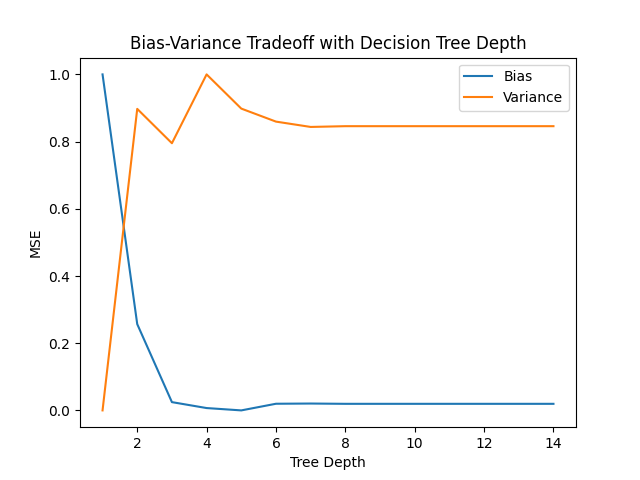

> Train test Error 

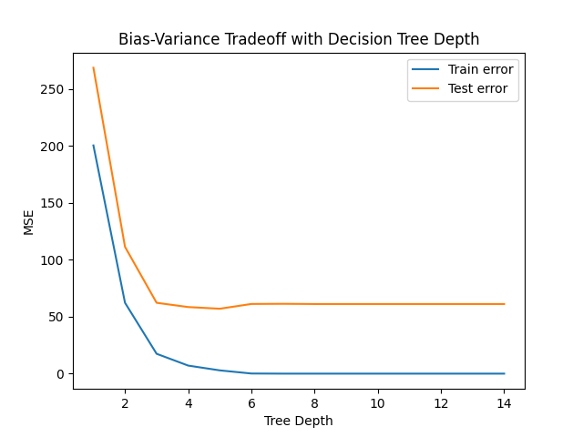


# Question 2

## Output

```python
          0         1
0  0.800227 -0.285654
1  0.941844 -0.060086
2 -0.347924 -0.866213
3 -0.222150 -0.911294
4 -0.772215 -0.240549
(100, 2) (100,) (100,)
X_train.shape, X_test.shape, y_train.shape, y_test.shape
(70, 2) (30, 2) (70,) (30,)
wt_train.shape, wt_test.shape
(70,) (30,)
Criteria : information_gain
+++++++++++Training metrics+++++++++++++
Accuracy:  1.0
Class:  1
        Precision:  1.0
        Recall:  1.0
Class:  0
        Precision:  1.0
        Recall:  1.0
+++++++++++Testing metrics+++++++++++++
Accuracy:  0.7333333333333333
Class:  1
        Precision:  0.6470588235294118
        Recall:  0.8461538461538461
Class:  0
        Precision:  0.8461538461538461
        Recall:  0.6470588235294118
+++++++++++Sklearn metrics+++++++++++++
Criteria : information_gain
+++++++++++Training metrics+++++++++++++
Accuracy:  1.0
Class:  1
        Precision:  1.0
        Recall:  1.0
Class:  0
        Precision:  1.0
        Recall:  1.0
+++++++++++Testing metrics+++++++++++++
Accuracy:  0.7333333333333333
Class:  1
        Precision:  0.6470588235294118
        Recall:  0.8461538461538461
Class:  0
        Precision:  0.8461538461538461
        Recall:  0.6470588235294118
Criteria : gini_index
+++++++++++Training metrics+++++++++++++
Accuracy:  1.0
Class:  1
        Precision:  1.0
        Recall:  1.0
Class:  0
        Precision:  1.0
        Recall:  1.0
+++++++++++Testing metrics+++++++++++++
Accuracy:  0.7333333333333333
Class:  1
        Precision:  0.6470588235294118
        Recall:  0.8461538461538461
Class:  0
        Precision:  0.8461538461538461
        Recall:  0.6470588235294118
+++++++++++Sklearn metrics+++++++++++++
Criteria : gini_index
+++++++++++Training metrics+++++++++++++
Accuracy:  1.0
Class:  1
        Precision:  1.0
        Recall:  1.0
Class:  0
        Precision:  1.0
        Recall:  1.0
+++++++++++Testing metrics+++++++++++++
Accuracy:  0.7666666666666667
Class:  1
        Precision:  0.6875
        Recall:  0.8461538461538461
Class:  0
        Precision:  0.8571428571428571
        Recall:  0.7058823529411765
```

## Plots

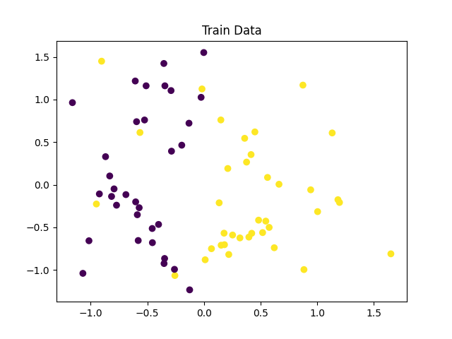

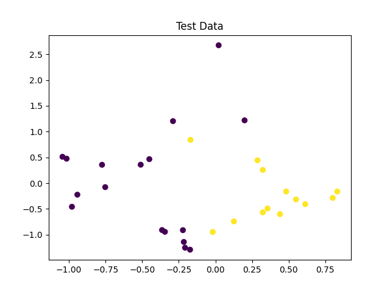


# Question 3

## Output

```python
X.shape:  (100, 2)
y.shape:  (100,)
-----------------------------
Tree Number: 1
-----------------------------
|--- feature_1 <= -0.18
|   |--- class: 0
|--- feature_1 >  -0.18
|   |--- class: 1

-----------------------------
Tree Number: 2
-----------------------------
|--- feature_0 <= 2.26
|   |--- class: 0
|--- feature_0 >  2.26
|   |--- class: 1

-----------------------------
Tree Number: 3
-----------------------------
|--- feature_1 <= 0.25
|   |--- class: 0
|--- feature_1 >  0.25
|   |--- class: 1


Accuracy:  0.98

class 1: 

Precision:  0.98

Recall:  0.98

class 2: 
Precision:  0.98

Recall:  0.98

```

## Plots

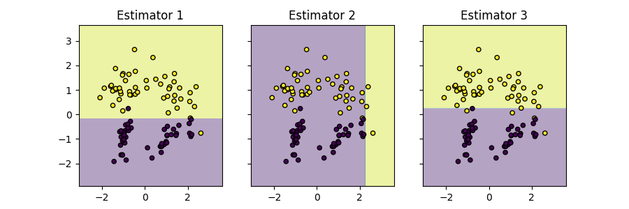
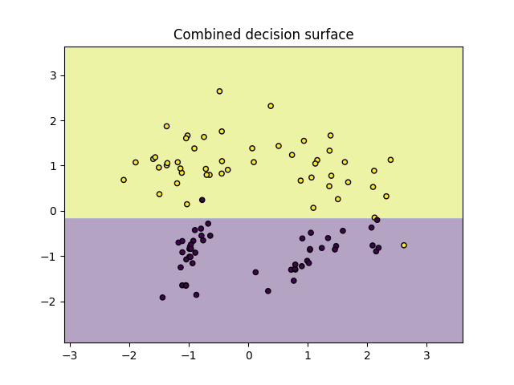
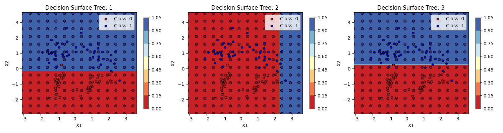
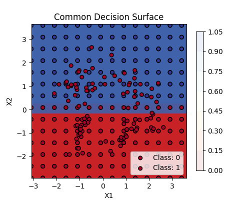

# Question 4

## Output

```python
sequencial bagging time 0.05329084396362305
Accuracy Squencial : 0.9765
Time Squencial : 0.0533 seconds
Precision seqential:  0.962227602905569
Recall sequential:  0.9920119820269596
Precision seqential:  0.9917312661498708
Recall sequential:  0.9609414121181773
parallel bagging
parallel bagging time 0.0743875503540039
Accuracy in Parallel : 0.97325
Time in Parallel : 0.0744 seconds
Precision parellel:  0.9601941747572815
Recall parellel:  0.9875187219171243
Precision parellel:  0.9871134020618557
Recall parellel:  0.9589384076114171
```

## Plots


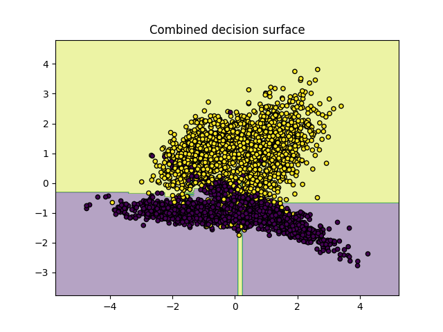


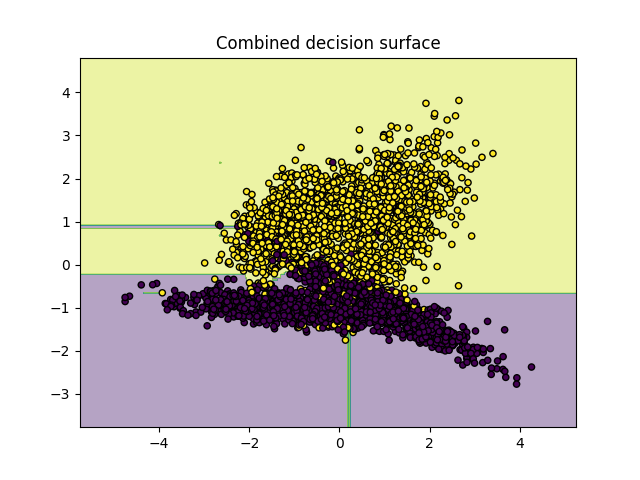

# Question 5

## Output

```python
########### RandomForestClassifier ###################
X.shape:  (30, 5)
y.shape:  (30,)
Criteria : information_gain
Accuracy:  1.0
class:  0
Precision of 0 is:  1.0
Recall of 0 is:  1.0
class:  3
Precision of 3 is:  1.0
Recall of 3 is:  1.0
class:  2
Precision of 2 is:  1.0
Recall of 2 is:  1.0
class:  4
Precision of 4 is:  1.0
Recall of 4 is:  1.0
class:  1
Precision of 1 is:  1.0
Recall of 1 is:  1.0
Criteria : gini_index
Accuracy:  1.0
class:  0
Precision of 0 is:  1.0
Recall of 0 is:  1.0
class:  3
Precision of 3 is:  1.0
Recall of 3 is:  1.0
class:  2
Precision of 2 is:  1.0
Recall of 2 is:  1.0
class:  4
Precision of 4 is:  1.0
Recall of 4 is:  1.0
class:  1
Precision of 1 is:  1.0
Recall of 1 is:  1.0
--------SKLEARN--------
Criteria : entropy
Accuracy:  1.0
class:  0
Precision of 0 is:  1.0
Recall of 0 is:  1.0
class:  3
Precision of 3 is:  1.0
Recall of 3 is:  1.0
class:  2
Precision of 2 is:  1.0
Recall of 2 is:  1.0
class:  4
Precision of 4 is:  1.0
Recall of 4 is:  1.0
class:  1
Precision of 1 is:  1.0
Recall of 1 is:  1.0
Criteria : gini
Accuracy:  1.0
class:  0
Precision of 0 is:  1.0
Recall of 0 is:  1.0
class:  3
Precision of 3 is:  1.0
Recall of 3 is:  1.0
class:  2
Precision of 2 is:  1.0
Recall of 2 is:  1.0
class:  4
Precision of 4 is:  1.0
Recall of 4 is:  1.0
class:  1
Precision of 1 is:  1.0
Recall of 1 is:  1.0
########### RandomForestRegressor ###################
X.shape:  (30, 5)
y.shape:  (30,)
sklearn rmse:  0.5687013387549009
RMSE:  0.5687013387549009
MAE:  0.44474751031572185
--------SKLEARN--------
sklearn rmse:  0.6270460210442432
RMSE:  0.6270460210442432
MAE:  0.4956744490066659
```


```python
########### RandomForestClassifier ###################
X.shape:  (30, 5)
y.shape:  (30,)
Criteria : information_gain
Accuracy:  0.9333333333333333
class:  0
Precision of 0 is:  0.9
Recall of 0 is:  1.0
class:  3
Precision of 3 is:  1.0
Recall of 3 is:  0.8571428571428571
class:  2
Precision of 2 is:  1.0
Recall of 2 is:  0.8571428571428571
class:  4
Precision of 4 is:  0.8
Recall of 4 is:  1.0
class:  1
Precision of 1 is:  1.0
Recall of 1 is:  1.0
Criteria : gini_index
Accuracy:  0.9666666666666667
class:  0
Precision of 0 is:  1.0
Recall of 0 is:  0.8888888888888888
class:  3
Precision of 3 is:  1.0
Recall of 3 is:  1.0
class:  2
Precision of 2 is:  0.875
Recall of 2 is:  1.0
class:  4
Precision of 4 is:  1.0
Recall of 4 is:  1.0
class:  1
Precision of 1 is:  1.0
Recall of 1 is:  1.0
--------SKLEARN--------
Criteria : entropy
Accuracy:  1.0
class:  0
Precision of 0 is:  1.0
Recall of 0 is:  1.0
class:  3
Precision of 3 is:  1.0
Recall of 3 is:  1.0
class:  2
Precision of 2 is:  1.0
Recall of 2 is:  1.0
class:  4
Precision of 4 is:  1.0
Recall of 4 is:  1.0
class:  1
Precision of 1 is:  1.0
Recall of 1 is:  1.0
Criteria : gini
Accuracy:  1.0
class:  0
Precision of 0 is:  1.0
Recall of 0 is:  1.0
class:  3
Precision of 3 is:  1.0
Recall of 3 is:  1.0
class:  2
Precision of 2 is:  1.0
Recall of 2 is:  1.0
class:  4
Precision of 4 is:  1.0
Recall of 4 is:  1.0
class:  1
Precision of 1 is:  1.0
Recall of 1 is:  1.0
########### RandomForestRegressor ###################
X.shape:  (30, 5)
y.shape:  (30,)
sklearn rmse:  0.5687013387549009
RMSE:  0.5687013387549009
MAE:  0.44474751031572185
regressor plot
--------SKLEARN--------
sklearn rmse:  0.6270460210442432
RMSE:  0.6270460210442432
MAE:  0.4956744490066659
classification plot
```

## Plots

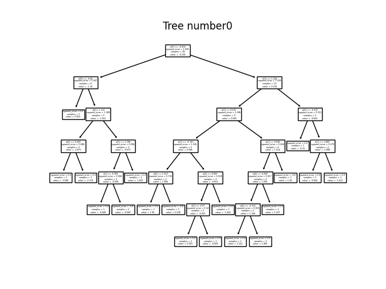
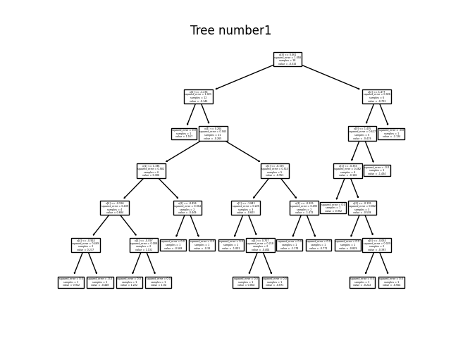
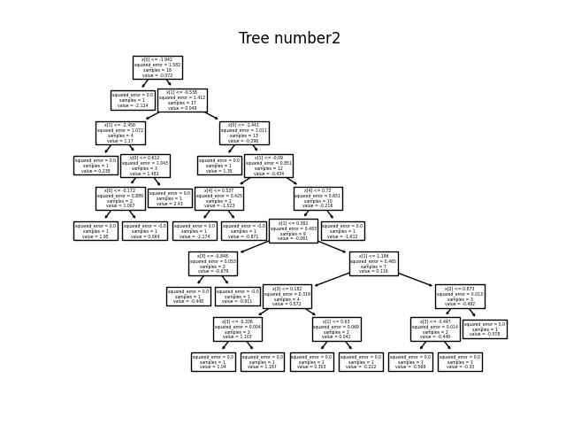
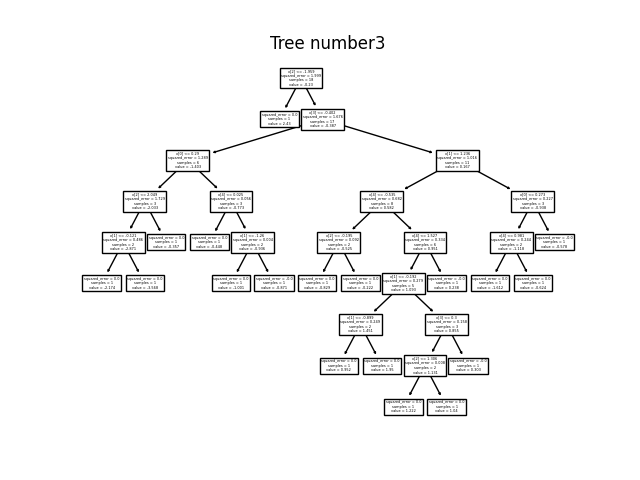
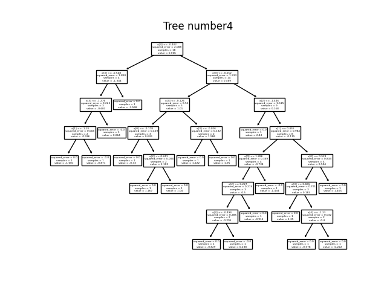
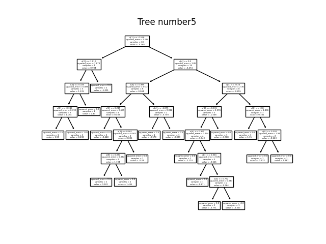
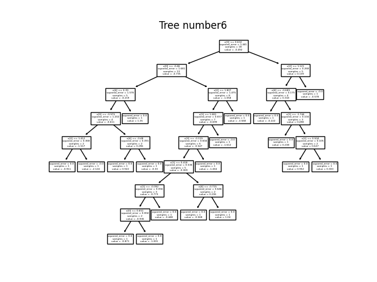
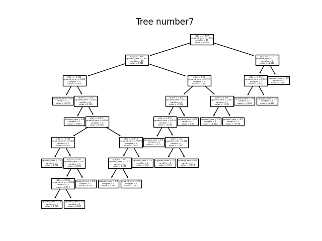
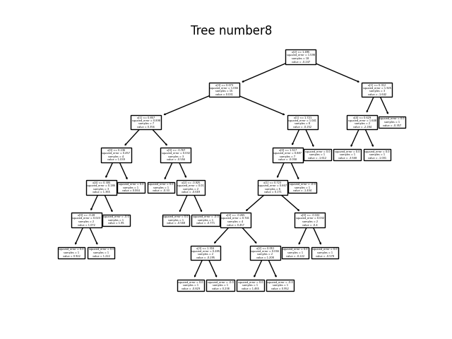
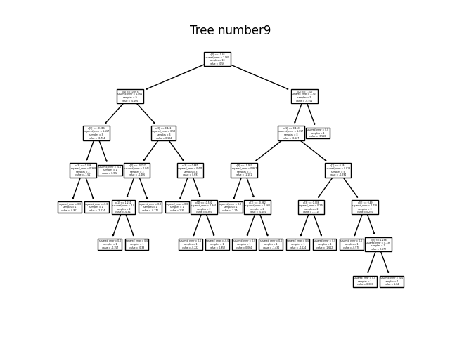

> Classifier Tree GINI

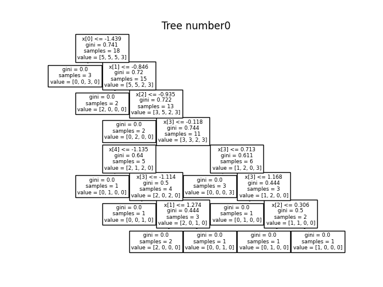
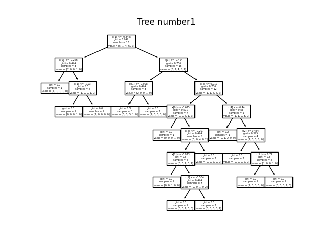
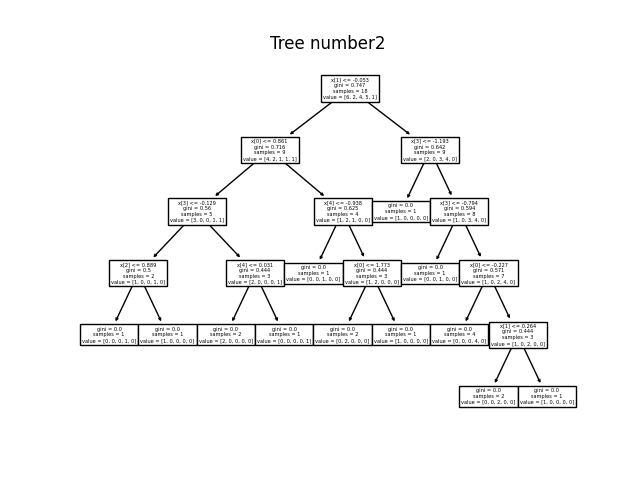
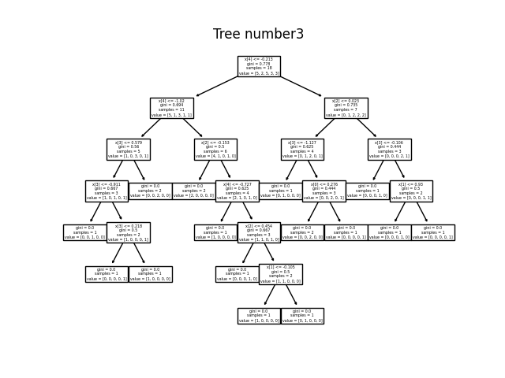
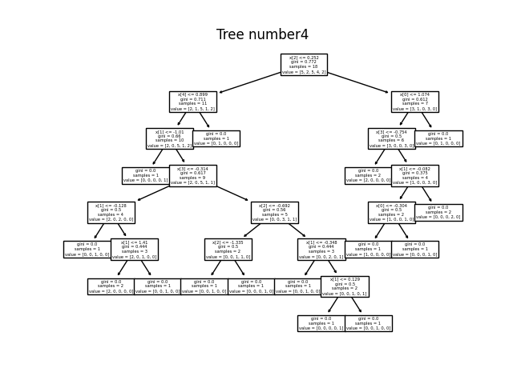
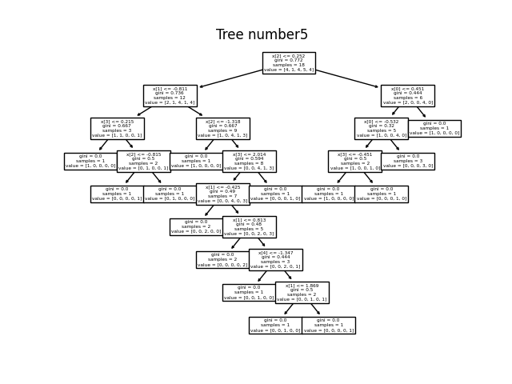
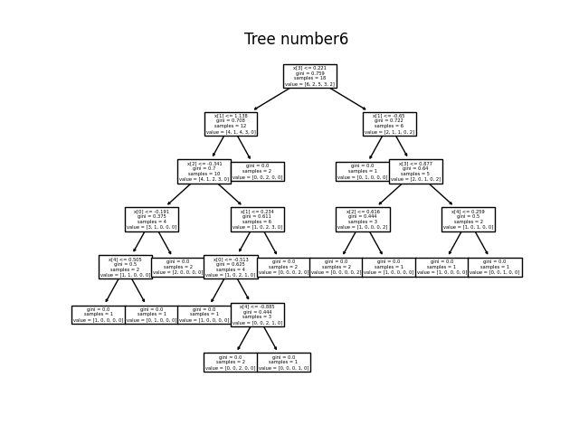
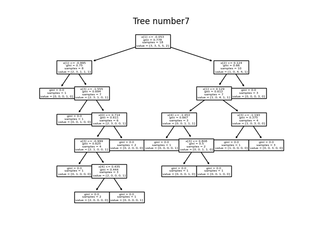
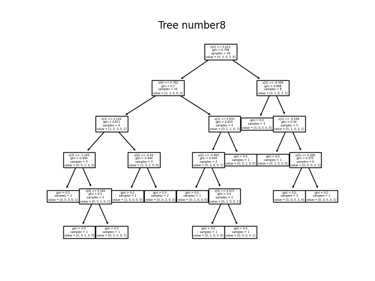
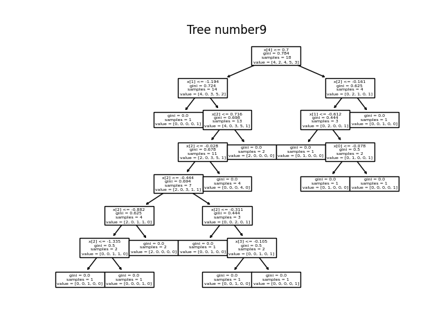

> Classifier Tree Information Gain

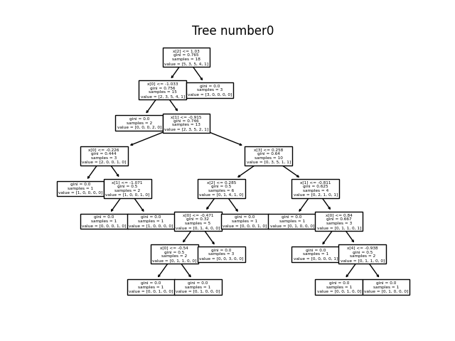
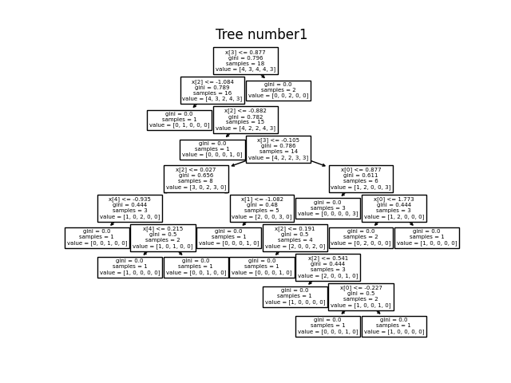
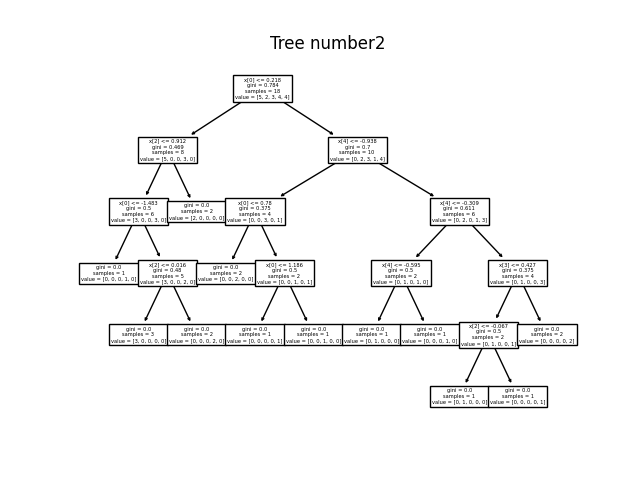
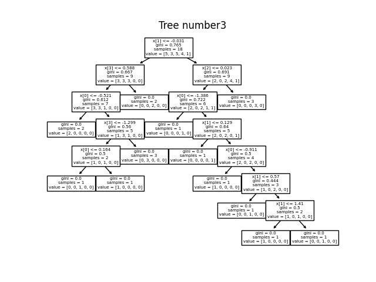
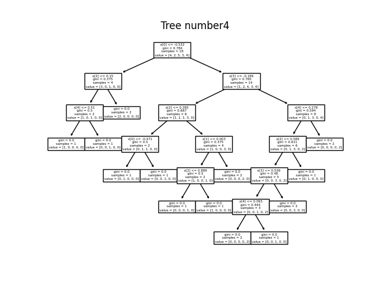
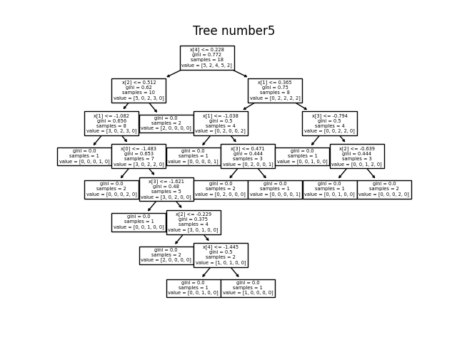
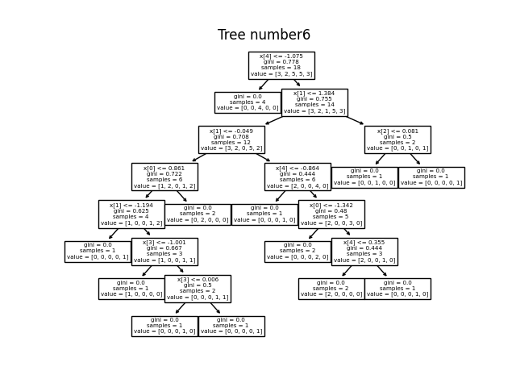
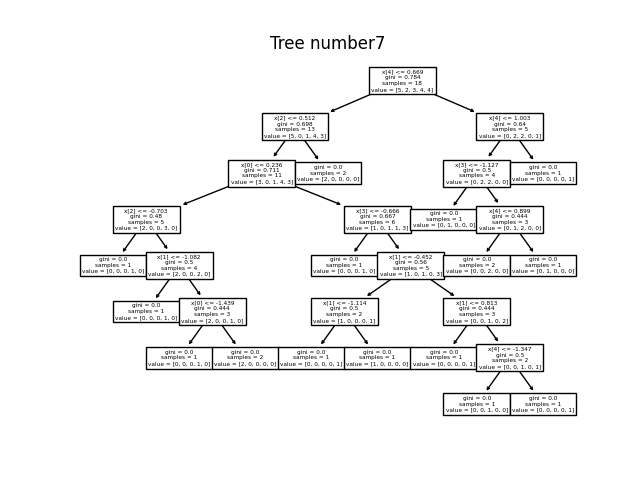
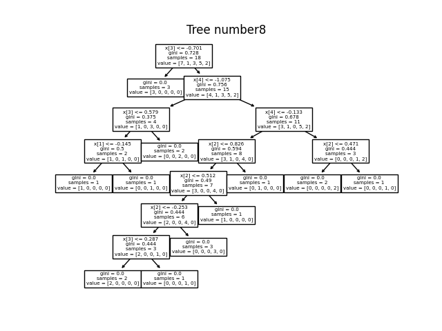
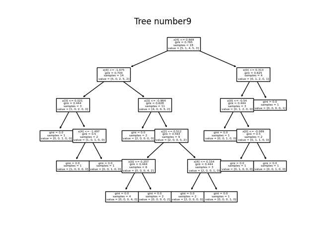

> Regressor Tree


> RandomForest 


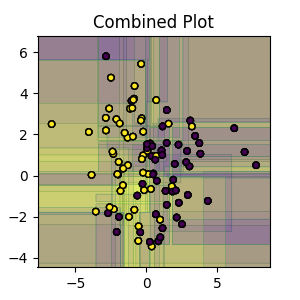


# Question 6

## Output

```python
----------------------
Learning Rate:  0.001 Estimators:  1 Depth:  1
MSE:  6807.583937870813
R2:  0.0010618585434940542
----------------------
Learning Rate:  0.001 Estimators:  1 Depth:  2
MSE:  6803.531336931662
R2:  0.001656533201517707
----------------------
Learning Rate:  0.001 Estimators:  1 Depth:  3
MSE:  6802.399560117484
R2:  0.0018226090130856187
----------------------
Learning Rate:  0.001 Estimators:  10 Depth:  1
MSE:  6743.104051575668
R2:  0.01052357335521703
----------------------
Learning Rate:  0.001 Estimators:  10 Depth:  2
MSE:  6702.940657379834
R2:  0.016417110139887114
----------------------
Learning Rate:  0.001 Estimators:  10 Depth:  3
MSE:  6691.724157405618
R2:  0.018063008264706304
----------------------
Learning Rate:  0.001 Estimators:  100 Depth:  1
MSE:  6153.615341313924
R2:  0.09702456431070072
----------------------
Learning Rate:  0.001 Estimators:  100 Depth:  2
MSE:  5791.971156103611
R2:  0.1500918747602774
----------------------
Learning Rate:  0.001 Estimators:  100 Depth:  3
MSE:  5687.752188019873
R2:  0.16538486317323353
----------------------
Learning Rate:  0.01 Estimators:  1 Depth:  1
MSE:  6742.782361107388
R2:  0.010570777896716566
----------------------
Learning Rate:  0.01 Estimators:  1 Depth:  2
MSE:  6702.438809987278
R2:  0.01649075073046824
----------------------
Learning Rate:  0.01 Estimators:  1 Depth:  3
MSE:  6691.171997279864
R2:  0.018144031696050056
----------------------
Learning Rate:  0.01 Estimators:  10 Depth:  1
MSE:  6150.964960156649
R2:  0.09741347862326188
----------------------
Learning Rate:  0.01 Estimators:  10 Depth:  2
MSE:  5787.988121139995
R2:  0.150676341375779
----------------------
Learning Rate:  0.01 Estimators:  10 Depth:  3
MSE:  5683.140483996032
R2:  0.16606158006553573
----------------------
Learning Rate:  0.01 Estimators:  100 Depth:  1
MSE:  2950.55421529334
R2:  0.5670385894626745
----------------------
Learning Rate:  0.01 Estimators:  100 Depth:  2
MSE:  1673.3504400658742
R2:  0.7544542096196843
----------------------
Learning Rate:  0.01 Estimators:  100 Depth:  3
MSE:  1292.2821033290184
R2:  0.8103718008740781
----------------------
Learning Rate:  0.1 Estimators:  1 Depth:  1
MSE:  6127.020771952688
R2:  0.10092702514453034
----------------------
Learning Rate:  0.1 Estimators:  1 Depth:  2
MSE:  5741.831087891324
R2:  0.15744937883361676
----------------------
Learning Rate:  0.1 Estimators:  1 Depth:  3
MSE:  5634.258504252694
R2:  0.1732344734798763
----------------------
Learning Rate:  0.1 Estimators:  10 Depth:  1
MSE:  2862.894234156068
R2:  0.5799017284906403
----------------------
Learning Rate:  0.1 Estimators:  10 Depth:  2
MSE:  1584.430919295237
R2:  0.7675021722490816
----------------------
Learning Rate:  0.1 Estimators:  10 Depth:  3
MSE:  1210.2066268257884
R2:  0.8224154752092838
----------------------
Learning Rate:  0.1 Estimators:  100 Depth:  1
MSE:  195.22129807786573
R2:  0.9713534195899135
----------------------
Learning Rate:  0.1 Estimators:  100 Depth:  2
MSE:  49.526032317498405
R2:  0.992732598947222
----------------------
Learning Rate:  0.1 Estimators:  100 Depth:  3
MSE:  13.853773099794772
R2:  0.9979671110222407
----------------------
Learning Rate:  1 Estimators:  1 Depth:  1
MSE:  3194.8227283588676
R2:  0.5311948691817403
----------------------
Learning Rate:  1 Estimators:  1 Depth:  2
MSE:  1167.5086017201268
R2:  0.8286809412295608
----------------------
Learning Rate:  1 Estimators:  1 Depth:  3
MSE:  601.3371088852197
R2:  0.9117603867361923
----------------------
Learning Rate:  1 Estimators:  10 Depth:  1
MSE:  483.7185533841821
R2:  0.9290196173685733
----------------------
Learning Rate:  1 Estimators:  10 Depth:  2
MSE:  138.4253993418564
R2:  0.9796875936586428
----------------------
Learning Rate:  1 Estimators:  10 Depth:  3
MSE:  43.52474451983985
R2:  0.9936132219896481
----------------------
Learning Rate:  1 Estimators:  100 Depth:  1
MSE:  51.82854482650237
R2:  0.9923947305364296
----------------------
Learning Rate:  1 Estimators:  100 Depth:  2
MSE:  0.03674515746849391
R2:  0.9999946080518957
----------------------
Learning Rate:  1 Estimators:  100 Depth:  3
MSE:  1.3724172884101043e-09
R2:  0.9999999999997986
Optimal params on MSE:  [1, 100, 3]
Optimal params on R2:  [1, 100, 3]
Min MSE:  1.3724172884101043e-09
Max R2:  0.9999999999997986
DTR MSE:  601.3371088852198
DTR R2:  0.9117603867361923

```

## Plots

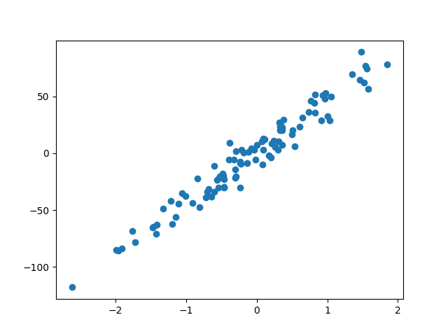
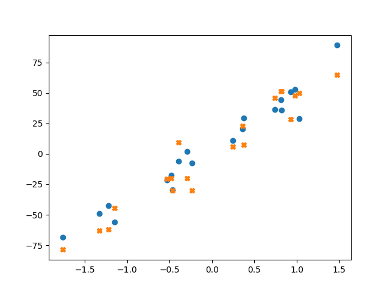
